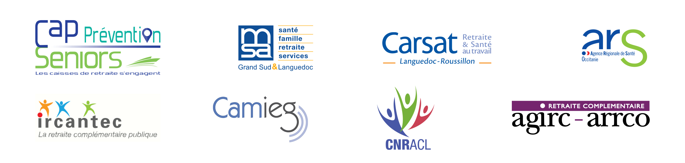

# i2ml/SeriousGame

## SeriousGame

Ce projet, s'inscrit dans un objectif de prévention en santé publique et prend la forme d'un serious-game ayant pour objectif l'apprentissage du bon comportement alimentaire de manière ludique. Ce jeu, conçu avec un diététicien, sera utilisé lors d'animations afin d'accompagner les acteurs du vieillissement sur le thème de la nutrition. Les conseils nutritionnels fournis par le jeu sont adaptés à un public âgé de 50 ans et plus. Le jeu a été co-construit en collaboration avec les habitants de la résidence seniors Domitys à Nîmes.

### Comment jouer

Le jeu se joue par équipe. Deux équipes guident le personnage dans ses choix sous les directive d'un maître du jeu qui peut s'appuyer sur le jeu pour transmettre des conseils supplémentaires. Nous mettons à la disposition du maitre du jeu, un guide complet pour le guider dans sa tâche.

### Financeurs

