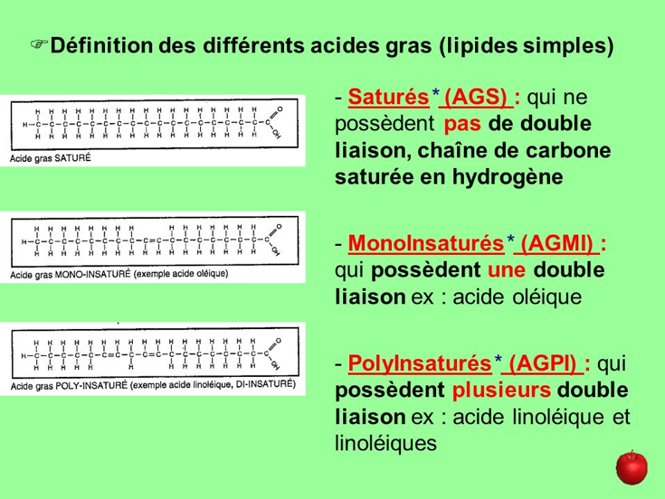

# Conseils nutritionnels spécifiques aux situations

### Situation 1 : 

`Il est 13 heures, Arthur sort de table, après son fromage il lui reste une petite place pour un dessert. Penché au-dessus de son frigo il hésite entre plusieurs options` 

#### Allergique ou intolérant au lait de vache ?

L’**allergie** est caractérisée par une réaction immunitaire grave face aux **protéines de lait**. Les symptômes sont alors amplifiés et plus graves que ceux de la sensibilité au lactose et nécessitent l’arrêt de la consommation de tous les produits laitiers.

Le glucide principal présent dans le lait de vache est le lactose. Cette molécule ne peut pas être assimilée telle quelle dans l’organisme. Il est donc indispensable de le fractionner en glucose et galactose. Cette enzyme indispensable se nomme la lactase. Cependant, chez la plupart des êtres humains et la quasi-totalité des mammifères, l’activité de la lactase diminue rapidement après le sevrage.

Les intolérants au lactose ne supportent donc pas le lait en raison d’un déficit en lactase, enzyme digestive qui dégrade ce sucre.

**Qu’est- ce qui provoque une intolérance au lactose ?**

Le glucide principal présent dans le lait de vache est le lactose. Cette molécule ne peut pas être assimilée telle quelle dans l’organisme. Il est donc indispensable de le fractionner en glucose. Cette enzyme indispensable se nomme la lactase. Cependant, chez la plupart des êtres humains et la quasi-totalité des mammifères, l’activité de la lactase diminue rapidement après le sevrage.

Les intolérants au lactose ne supportent donc pas le lait en raison d’un déficit en lactase, enzyme digestive qui dégrade ce sucre.

### Situation 2 :

`Arthur est au travail, il mange au restaurant lors de sa pause déjeuner. Il hésite entre plusieurs choix à la carte du restaurant.`

#### Pourquoi parle-t-on de mauvais \(LDL\) et bon \(HDL\) cholestérol ?

Les lipoprotéines HDL ont pour rôle de capter les molécules de cholestérol qui se déposent dans les artères, pour les transporter vers le foie. Ce dernier se chargera ensuite d'éliminer le cholestérol par le tube digestif grâce à la bile. Les HDL permettent donc de diminuer le taux de cholestérol dans le sang, d'où le nom de "bon" cholestérol.

Les lipoprotéines LDL déposent le cholestérol sur les parois des artères, ce qui occasionne des plaques de graisse appelées plaques d'athérome, d'où le nom de "mauvais" cholestérol. 

Le cholestérol est essentiel à l’organisme. Il est le précurseur des hormones stéroïdes et des sels biliaires. 

### Situation 3 : 

`Arthur souhaite améliorer son petit-déjeuner. Sa diététicienne lui a conseillé : un verre de lait, un fruit et une tartine de pain complet avec un petit peu de beurre et de confiture. Connaissant ses inconforts digestifs…`

**Pourquoi le lait de brebis, de montagne et le yaourt sont- ils plus simples à digérer ?**

Le **lait de brebis** est très riche en matières grasses, deux fois plus que le **lait de vache** pour être plus exact. Toutefois, ses globules gras sont plus petits le rendant plus facile à digérer. De plus, le **lait de brebis** contient beaucoup plus de calcium, ce qui le rend particulièrement intéressant sur le plan nutritionnel.

Concernant **le lait de montagne** :

La caséine est le groupe majeur de protéines dans le lait, ce qui représente environ 80% du contenu total de protéines.

Il y a plusieurs types de caséine dans le lait mais les deux formes les plus communes de la caséine beta sont les suivantes :

·       **La caséine beta A1 :**Le lait des races de vaches qui proviennent de l’Europe du Nord est généralement riche en caséine beta A1. Le lait A1 provient de races comme Holstein, Friesian, Ayrshire et British Shorthorn.

·       **La caséine beta A2 :**Le lait est riche en caséine beta A2 provient principalement des races qui des îles Anglo-Normandes et du Sud de la France. Ça inclut les races comme Guernesey, Jersey, Charolais et Limousin \([1](http://www.ncbi.nlm.nih.stfi.re/pubmed/15453478?sf=vkvpayj), [2](http://www.ncbi.nlm.nih.stfi.re/pubmed/15867940?sf=yrbpwrp)\).

Le lait ordinaire contient à la fois la caséine beta A1 et A2, mais le lait A2 ne contient que la caséine beta A2. Selon certaines théories, la bêta-caséine A1 serait plus difficile à digérer pour certaines personnes en ralentissant le transit intestinal et donc pourrait entrainer de la constipation. Elle pourrait aussi causer de l’inflammation et ainsi occasionner des maux de ventre et d’autres symptômes digestifs chez les personnes qui sont plus sensibles.

Les individus qui souffrent d’intolérance au lactose tolèrent habituellement bien le **yaourt**, car le lactose y est déjà partiellement hydrolysé par les bactéries.

#### Que penser des produits laitiers sans lactose \(lait matin léger de lactel par exemple\) ?

Matin Léger est un lait qui vous apporte autant de calcium, de protéines et de vitamine D qu'un lait classique. Le lactose n’a pas été enlevé du lait Matin Léger, il a été divisé en deux sucres pour être plus facilement absorbés par l’organisme. Les éléments qui composent le lactose font donc toujours partie de Matin Léger mais ne perturbent plus la digestion. Il permet ainsi aux personnes intolérantes au lactose de pouvoir boire du lait.

### Situation 4 :

Arthur cultive son potager, un matin un ami passe lui rendre visite et cueille une tomate, Arthur lui dit « tu peux y aller ça, c'est bio ! » une discussion s’entame. Arthur a l’habitude de cultiver lui-même les légumes qu’il ne trouve pas dans son supermarché en bio. Son ami lui soutient qu’il devrait faire confiance aux producteurs locaux même si ces derniers ne sont pas labellisés.

#### Qu’est-ce qu’un label ?


Un label est une marque de production, de commercialisation ou tout simplement un identifiant. Elle reflète un savoir-faire, une direction artistique, une identité.


**Pourquoi privilégier le bio ?**

Le bio garantit un aliment de qualité cultivé sans pesticides et avec une charte de qualité stricte.

**Pourquoi privilégier le local ?**

Le local garantit un aliment avec une faible émission carbone lié à son transport mais il n’est pas forcément bio et peut donc avoir un impact sur la santé.

**Pourquoi manger en respectant les saisons ?**

Chaque saison répond à un besoin du corps humain. En hiver, avec le froid et le manque de soleil, notre corps réclame plus de nutriments et de vitamines C. Tant mieux, c’est la saison des légumes riches en minéraux \(poireaux, choux, épinards\) et des agrumes pleins de vitamine C \(mandarines, pamplemousses, clémentines\). En été, avec la chaleur, notre organisme dépense moins de calories mais demande plus d’eau : tous les fruits et légumes de la saison en sont gorgés : melons, tomates, courgettes, pastèques, etc. ! Manger de saison permet donc de varier son alimentation. 

Autre avantage des fruits et légumes de saison : ils auront plus de chance d’avoir mûri au soleil et seront donc plus savoureux que les fruits et légumes qui arrivent à maturité pendant le transport. Vous pourrez profiter ainsi du goût, des vitamines et de tous leurs bienfaits. 

De plus, les prix sont souvent moins élevés car les produits viennent de moins loin, il y a moins d’intermédiaires ce qui permet d’avoir les prix les plus bas possible.

### Situation 5 :

`Arthur se rend chez son poissonnier, il hésite entre plusieurs options...`

#### Pourquoi le saumon est particulièrement exposé aux polluants et métaux lourds ?

Les poissons au sommet de la chaine alimentaire, c’est-à-dire les plus imposants, sont plus susceptibles de contenir de fortes quantités de métaux lourds \(mercure, plomb\) et des polluants, dont certains composés tels que les PCB qui sont très liposolubles. Ces molécules ont des effets sur le développement mental et moteur de l’enfant, ainsi que sur le système endocrinien de l’adulte.

#### Quels sont les rôles des omégas 3 et où les trouver ?

* Fluidification du sang
* Développement du système nerveux
* Développement de la rétine


Les oléagineux, certaines huiles \(noix, soja, colza, lin\), les poissons gras \(saumon, sardine, maquereau\), épinard, avocat sont les principales sources d'omégas 3


#### Quels sont les rôles des omégas 6 et où les trouver ?

* Intervient dans la réponse immunitaire
* Diminue LDL-cholestérol \(=baisse de la lipémie\)


La plupart des huiles végétales : huile de tournesol, huile de pépin de raisin, huile de germe de blé sont des sources d'omégas 6.


#### Pourquoi respecter le rapport oméga 6/oméga 3 &gt; 5 ?

Respecter le rapport permet la stabilisation entre fluidification et coagulation du sang.

### Situation 6 :

`Ce soir c’est pomme de terre sautées ! Quelle matière grasse utiliser ?`

#### Quelle est la différence de structure entre AGS, AGMI, AGPI ?

#### Qu’est- ce qu’un point de fumée ?

Le point de fumée est la température à partir de laquelle les huiles ou graisses alimentaires se décomposent et se dénaturent : la substance fume, ou brûle, et forme des composés cancérigènes donnant ainsi un mauvais goût. 

**De quel facteur dépend le point de fumée d'une graisse ?**

Le point de fumée d’une graisse dépend essentiellement de la part d’acides gras libres qu’elle contient. Plus cette part est élevée, plus le point de fumée est bas.

#### Quelles sont les points de fumées des différentes huiles ? 

| Huile | Point de fumée |
| :--- | :--- |
| Beurre | 130°C |
| Huile de tournesol raffinée | 232°C |
| Huile de tournesol non raffinée | 160°C |
| Huile d’arachide | 160°C |
| Huile d’olive extra vierge | 191°C |
| Huile d’olive vierge | 216°C |

#### Qu’est-ce qu’une huile raffinée ?

Une huile végétale sera qualifiée de vierge ou raffinée selon son mode d'extraction. Si l'extraction s'opère par pression, elle est qualifiée d'huile vierge. Si l'extraction s'opère par solvants elle est dénommée huile raffinée ce qui permet d'obtenir une huile « standardisée » par modification de ses acides gras.

### Situation 7 :

`Arthur est dans son supermarché et achète du steak haché pour dîner. A cause de sa conjonctivite, il n’arrive pas à lire correctement les étiquettes et ne sait pas lequel choisir...`

#### Sur quelles bases yuka établit un score ?

Le calcul du score prend en compte les éléments suivants : calories, sucre, sel, graisses saturées, protéines, fibres, fruits et légumes.

**Sur quelles bases s’établit le nutri-score ?**

Pour classer chaque produit, des équipes de recherches internationales ont mis au point un score qui prend en compte, pour 100 grammes de produit, la teneur :

·       en **nutriments et aliments à favoriser :** fibres, protéines, fruits et légumes

·       en **nutriments à limiter :** énergie, acides gras saturés, sucres, sel

Après calcul, le score obtenu par un produit permet de lui attribuer une lettre \(de A à E\) et une couleur \(vert à rouge\).

Seuls les aspects nutritionnels sont pris en compte dans calcul du Nutri-Score. Il n’inclut pas d’autres dimensions comme les additifs ou les pesticides.

#### Échelle de transformation :

* Produits non transformés : tous les produits bruts➡fruits, légumes, œufs, … 
* Produits peu transformés : aliment ayant subi des manipulations \(découpage, lavage, épluchage,…\) sans ajout de substance➡légumes surgelés
* Produits transformés : tous les produits auxquels on ajoute des substances que l’on peut trouver dans nos cuisines➡légumes en conserve
* Produits ultra-transformés : produits auxquels on ajoute des substances qui ne sont pas présentes dans nos cuisines➡cordon bleu

#### Quels sont les risques des aliments transformés sur la santé ?

Dans les aliments transformés, on retrouve des acides gras trans. Les acides gras trans sont des acides gras insaturés, dont au moins une double liaison est en position trans, contrairement aux acides gras insaturés synthétisés par l’organisme dont les doubles liaisons sont en position cis.


Une consommation excessive d’acides gras trans augmenterait le risque de maladies cardiovasculaires. En effet, les acides gras trans augmentent le cholestérol sanguin et entraînent une inflammation des vaisseaux sanguins.


Si les atomes d’hydrogène sont de part et d’autre de la chaîne carbonée, l’arrangement est appelé trans.

### Situation 8 :

`Arthur reçoit des amis végétariens pour le dîner, il se demande comment remplacer les protéines de la viande dans le repas qu'il prépare.`

#### Qu’est-ce qu’un acide aminé essentiel ? 

Un acide aminé essentiel est un acide aminé qui ne peut être synthétisé par l'organisme ou qui est synthétisé à une vitesse insuffisante, et doit donc être apporté par l'alimentation, condition nécessaire au bon fonctionnement de l'organisme.

#### Quels sont les acides aminés essentiels ?

Tryptophane, lysine, phénylalanine, valine, histidine, leucine, isoleucine, thréonine, méthionine.

#### Exemples de sources à associer pour une complémentarité protéique :

* Riz/ haricots rouges
* Semoule de blé/pois chiches
* Riz/ lentilles

#### Qu’est-ce qu’un facteur limitant ?

Le facteur limitant correspond à un acide aminé qui est peu ou pas présent dans un aliment protéique. 

### Situation 9 :

`Arthur se rend en réunion chez un client, celui-ci lui propose comme souvent un goûter composé d’une viennoiserie et d’un café, que fait il ?`

#### Une collation est-elle indispensable pour l’équilibre alimentaire ?

De manière générale, les personnes âgées ne mangent plus suffisamment pour couvrir leurs besoins alimentaires. Il faut donc mettre en place des stratégies pour compenser la baisse d’appétit en adaptant les repas et notamment en ajoutant une collation. Pour maintenir des apports alimentaires variés et en quantité suffisante, Il est donc important de répartir ses apports selon le rythme alimentaire suivant :

* Petit-déjeuner : 20% soit environ 400 kcal
* Déjeuner : 35% soit environ 700 kcal
* Collation : 10% soit environ 200kcal
* Dîner : 35% soit environ 700 kcal

#### Qu’est-ce que l’hypoglycémie réactionnelle ?

L’hypoglycémie réactionnelle survient après une élévation soudaine de la glycémie suite à un repas. De l’insuline \(hormone hypoglycémiante\) est libéré afin de réguler le taux de glucose dans le sang, mais libérée en trop grande quantité, elle provoque une hypoglycémie.

**Quels sont les bienfaits des oléagineux ?**

Ils apportent généralement :

* Minéraux \(magnésium, fer, calcium, potassium\)
* Vitamines dites « liposolubles » \(A, D, E, K\)
* Acides gras insaturés \(notamment des omégas 3\) et phytostérols \(qui régulent le cholestérol\)
* Protéines \(jusqu'à 27 % suivant les fruits secs\)
* Fibres

### Situation 10 :

`Arthur rentre du travail fatigué, il n’a pas le courage de faire le repas.`

Comment composer un repas équilibré ?

### Situation 11 :

`Arthur souhaite améliorer sa condition physique. Il pense qu'il devrait pratiquer une activité physique`

**Pourquoi faut-il pratiquer une activité physique régulière ?**

Lors du passage à la retraite, notre activité diminue. En bougeant moins, la masse musculaire va peu à peu diminuer. Cela peut entraîner un état de fatigue physique ou moral qui est parfois signe d’un début de dénutrition. Il faut donc maintenir une bonne activité physique qui permettra d’entretenir la masse musculaire.

**Quels types d’exercices faut-il faire ?**

Faire ses courses, marcher, jardiner, faire le ménage, voire quelques exercices adaptés à la mobilité, etc...

### Situation 12 :

`En hiver Arthur se rend au marché. Quel panier choisit-t-il pour ses repas de la semaine ?`

**Pourquoi la pomme de terre est un féculent et non un légume ?**

La pomme de terre est un aliment riche en amidons et en glucides, avec une teneur beaucoup plus élevée que celle de la plupart des autres légumes. Cette teneur est semblable à celle des autres féculents \(riz, pâtes, etc..\).

