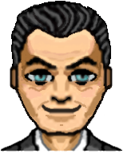
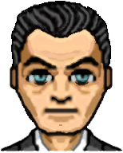
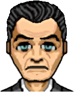

# Le profil du personnage

### Liste des éléments:

La page du profil est composée de plusieurs éléments notables:

* La note
* Les informations personnelles d'Arthur
* Le poids
* Les jauges

### Informations générales

La note est l'indicateur principal pour la performance des joueurs de manière générale. Il existe quatre notes possibles qui dépendent des jauges des deux équipes.


L'objectif de tous les joueurs est d'obtenir la note de A.


Voila les conditions à valider pour chacune des notes :

* A : 4 jauges dans le vert
* B : 1 à 3 jauge dans le vert aucune jauge dans le rouge
* C : aucune jauge dans le rouge
* D : une jauge dans le rouge


La photo de profil d'Arthur évolue également en fonction de sa situation.


<table>
  <thead>
    <tr>
      <th style="text-align:left">Heureux</th>
      <th style="text-align:left">Normal</th>
      <th style="text-align:left">Triste</th>
    </tr>
  </thead>
  <tbody>
    <tr>
      <td style="text-align:left">
        
      </td>
      <td style="text-align:left">
        

        

          
        

      </td>
      <td style="text-align:left">
        

        

          
        

      </td>
    </tr>
    <tr>
      <td style="text-align:left">Deux jauges dans le vert</td>
      <td style="text-align:left">Aucune jauge dans le rouge</td>
      <td style="text-align:left">une jauge dans le rouge ou plus</td>
    </tr>
  </tbody>
</table>

Le profil indique aux deux équipes des informations très précieuses quant aux préférences culinaire d'Arthur ainsi qu'à propos de ses problèmes de santé. il est du devoir du maître du jeu de faire en sorte que ces informations puissent être utilisées par les équipes.

La courbe du poids se dévoile au fur et à mesure de la partie. Elle est scriptée et n'influence pas les décisions du personnage. Cependant, elle est corrélée avec la situation afin d'apporter plus de visibilité aux équipes quant à la situations d'Arthur en terme notamment de condition physique. Cet état est indépendant des quatre jauges.

Les jauges sont les principales indicateurs de l'état d'Arthur durant le jeu.

Chaque équipe contrôle deux jauges. Les jauges peuvent apparaître de 3 couleurs différentes :

* Rouge : 25 % ou moins
* Jaune : 30 à 55 %
* Vert : 60  % ou plus

Les indications à droite des jauges correspond à l'évolution de la jauge depuis la situations précédente. 


Les jauges ne peuvent varier que par tranche de 5.


### Écran de fin de jeu

A la fin du jeu, l'écran affiché est le profil du personnage.

Une fois sur cet écran, si vous souhaitez recommencer une partie, rafraîchissez la page.

