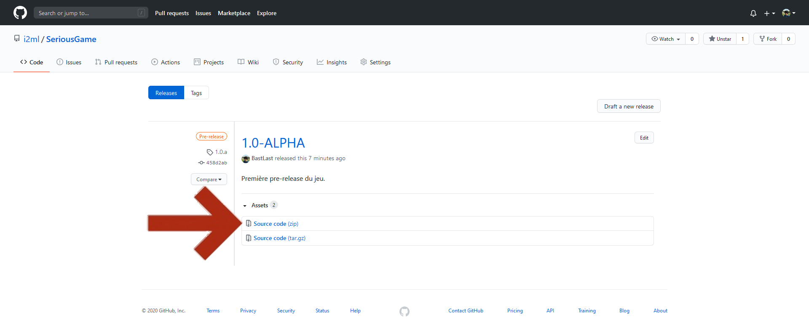

# Mise en place technique

## Matériel nécessaire.

* Un ordinateur \(mac, linux, windows\).
* Un vidéo projecteur ou autre écran de taille raisonnable, visible par tous les joueurs.


Le jeu est également jouable sur une tablette en mode paysage, cependant , la seule configuration de jeu pour laquelle cela serait pertinent serait pour un jeu en 1 contre 1 ou chaque équipe est composée d'une unique personne. Le maître du jeu peut alors servir d'intermédiaire et passer la tablette aux deux joueurs.


## Mise en place.

Avant de commencer votre partie, assurez vous que le jeu fonctionne correctement avec votre installation. Configurez votre ordinateur pour que le contenu de l'écran soit visible sur votre télévision ou vidéo projecteur.Utilisez ce lien pour accéder au jeu avec une connexion internet.



## Jouer sans connexion internet.

Il est possible de jouer au serious-game sans avoir de connexion internet. Cependant, cela nécessite un petit peu de préparation en amont.

Rendez vous sur le github du projet en suivant ce lien. 



Dirigez vous ensuite vers la page **Releases**

Choisissez la version du jeu à laquelle vous souhaitez jouer dans la liste et cliquez sur **Source code \(zip\)**. 


Nous vous conseillons de choisir la version marquée **Latest**


Le téléchargement du jeu doit avoir démarré. Une fois ce dernier terminé, vous obtiendrez une archive zip. Déplacez le fichier vers un lien qui vous convient

Une fois positionnée là ou vous le souhaitez, décompressez l'archive.


Dans l'exemple ci-dessus, la décompression est effectuée à l'aide du logiciel gratuit 7zip.  
Cet outil peut être téléchargé ici : [https://www.7-zip.org/download.html](https://www.7-zip.org/download.html)


Une fois décompressé, vous obtenez un dossier contenant le code du jeu. Pour lancer le jeu il vous suffit d'ouvrir le fichier **index.html** à l'aide du navigateur de votre choix. 

